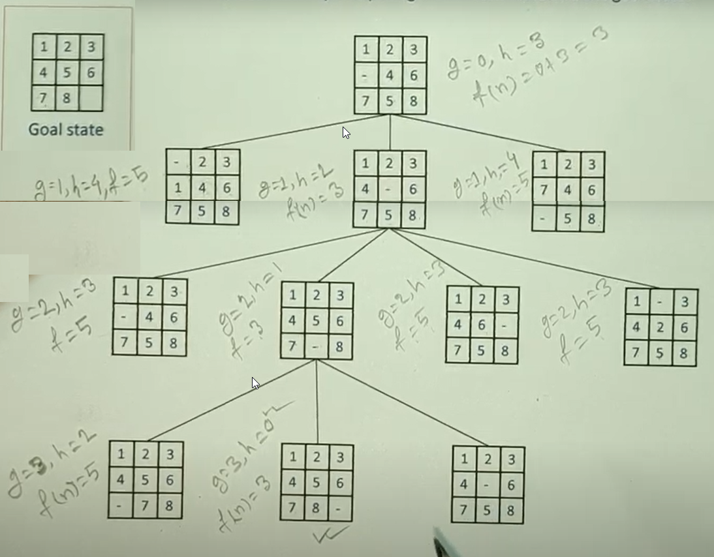
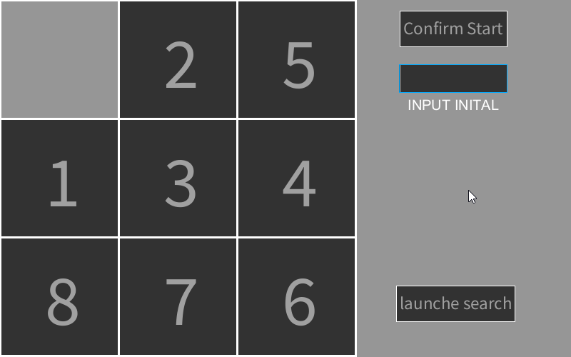

# 3x3 Sliding Puzzle Solver

## Description

The aim of this project was to find a solution to 3x3 Sliding Puzzle using A* search algorithm Python.

The use of A* is explained on the image below

 
<br>

The picture below shows the program process 

 
<br>

The most importent used libraries:

**- Processing External Libraries**
-  **controlP5**: used to create the text input field

****

## Project Files

```bash
|____assets
| |____images
| | |____deroulement.png # readme image
| | |____puzzle.gif # readme image
|____puzzle
| |____Astar.pde # A* algorithme
| |____Class.pde # contains the classes
| |____Functions.pde # contains utils functions
| |____puzzle.pde# # contains the main programme
|____readme.md
```

****

## Installation

<a href="https://processing.org/download">Processing</a> is needed to run the programme.


****

## Usage

- Open and run the **`puzzle.pde`** with Processing.

- Declare the initial state by sliding the box to obtain a given state or by entering an initial state in the text input field `example [2 3 4 5 6 7 8 1 0]` (sliding box is optional since initial state is good to go)

- Launches the solution by clicking on **`launches search`** button


